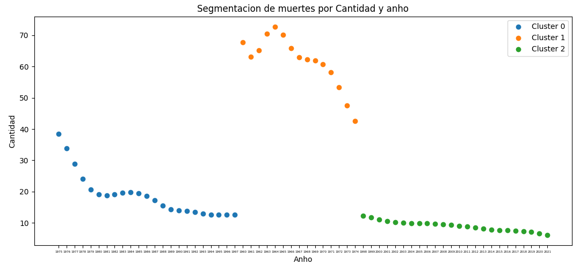
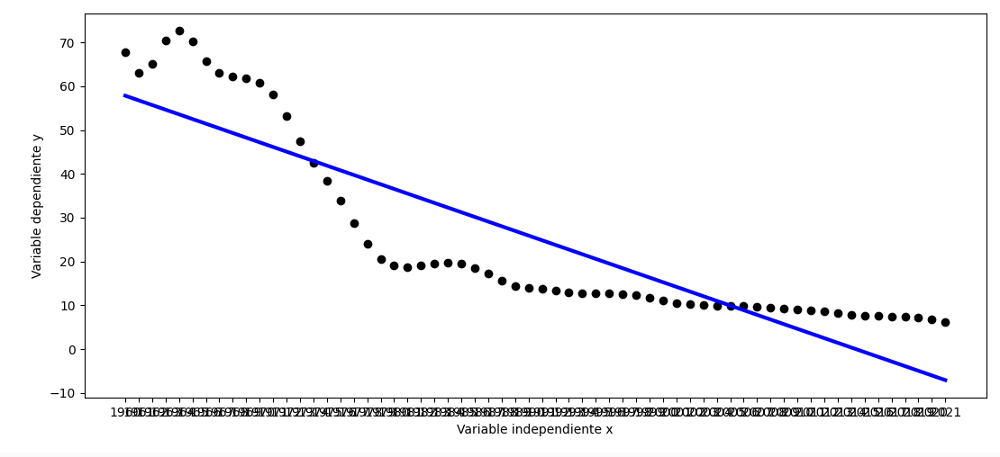
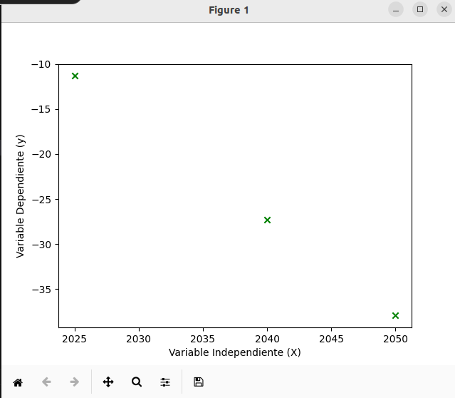

# Tarea 6

### 1. Ejecucion del script

Para la ejecucion del script es necesario descargar el repositio desde github con el SSH:

git@github.com:mugiwaratico/ie0217.git

Para esto se debe seguir la siguiente instruccion desde la linea de comandos eligiendo la ruta que se desee:

```"bash"
$ git clone git@github.com:mugiwaratico/ie0217.git
```

Una vez clonado el repositorio es necesario cambiar la ruta hacia donde esta nuestro archivo .py. Para esto siga la siguiente instruccion:

```"bash"
$ cd ./ie0217/T6
```
Una vez en esta ruta, es posible ejecutar el archivo de python mediante el siguiente comando:

```"bash"
$ python3 datos.py
```

Debido a que se llevo a cabo un analisis de datos, algunas partes del codigo estan comentadas para efectos de observar los pasos que se llevaron para la generacion del analisis, asi como los plot de los graficos de estos pasos.

## 2. Obtencion de los datos

A partir de la plataforma en el enlace: https://www.kaggle.com/datasets?tags=11105-Education

Se obtuvo en conjunto de datos, en este caso se hizo analisis del que lleva el titulo "mortality-rate-infant-per-1000-live-births". El cual indica la tasa de mortalidad de recien nacidos por cada 1000 nacimientos. De este se extrajo el conjunto de datos para el pais Costa Rica, para esto se utilizaron algunas instrucciones de pandas que permitieron organizar los datos con especial enfasis en las siguientes:

```"bash"
data = data.drop(['Country Code','Indicator Name','Indicator Code'], axis=1)

data = data.transpose()

data = data.reset_index()

data.columns= ['Anho', 'Cantidad']
```
Estas permitieron borrar las columnas no necesarias, permitiendo el enfoque en el anho y el numero de muertes asociado. Se hizo un transpose del dataframe y se agregaron los indices de este.

A partir de la libreria matplot se obtuvo la siguiente grafica de cantidad vs anho:


La cual muestra un decrecimiento en la tasa de muertes de recien nacidos a lo largo de los anhos.

### 3. Clustering

### 3.1 Metodo del codo

A parti del metodo del codo se estima el numero de clusters ideal para el analisis de los datos. Por medio de python se genera la siguiente grafica:


A partir de la figura anterior se evidencia que la inercia decae en el valor k = 3. Por lo que se elige este valor para el conjunto de clusters.

### 3.2 Kmeans

Una vez definido el numero de clusters es posible aplicar el metodo de K-means para el analisis por conjuntos de los datos:



A partir de esta grafica se evidencia una gran diferencia entre estos tres grupos, siendo los primeros anhos los que mas mortalidad en recien nacidos se tuvieron, decayendo conforme el paso de los anhos hasta la actualidad.

### 4. Regresiones

Mediante la libreria sklearn es posible implementar una regresion lineal a partir del dataframe generado. Una vez que se corre el script se obtiene la siguiente grafica de dispersion junto a la recta de mejor ajuste:



Por la forma que se observa en la grafica de dispersion una recta para predecir el comportamiento probablemente no sea lo mas adecuado de implementar. Se podria pensar en implementar un grafico de logaritmo por la forma que este tiene. Por lo que el modelo obtenido considero que no es de mucha confianza.

Sin embargo, a continuacion se observa la estimacion de resultados para los anhos 2025, 2040 y 2050. Donde se ve una disminucion de los valores con el paso del tiempo.



Se observa que se llegan a valores negativos, suponiendo que se llega al punto donde la mortalidad de los recien nacidos para cada 1000 de estos se vuelve cero. 

Como conclusion, viendo de a primeras el comportamiento de los datos, es facil intuir en que el numero conforme el paso de los anho disminuira, pero no a una tasa tan rapida como la que sugiere una relacion linea.