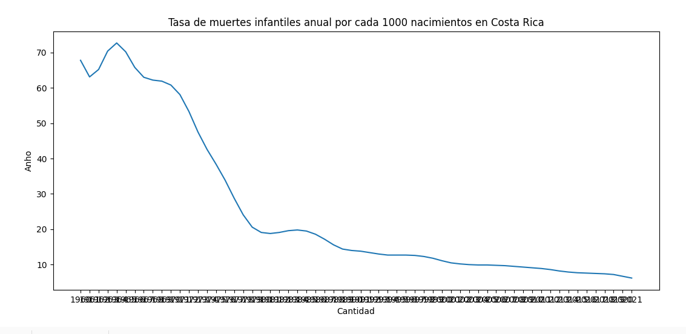
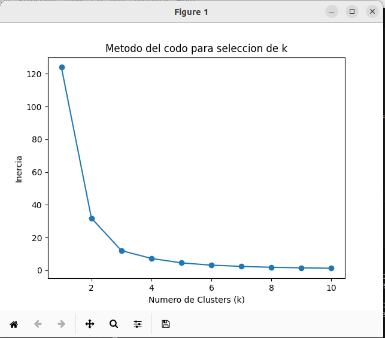

# Tarea 6

## 1. Obtencion de datos

A partir de la plataforma en el enlace: https://www.kaggle.com/datasets?tags=11105-Education

Se obtuvo en conjunto de datos, en este caso se hizo analisis del que lleva el titulo "mortality-rate-infant-per-1000-live-births". El cual indica la tasa de mortalidad de recien nacidos por cada 1000 nacimientos. De este se extrajo el conjunto de datos para el pais Costa Rica, para esto se utilizaron algunas instrucciones de pandas que permitieron organizar los datos.

A partir de la libreria matplot se obtuvo la siguiente grafica de cantidad vs anho:

La cual muestra un decrecimiento en la tasa de muertes de recien nacidos a lo largo de los anhos.

### 2. Clustering

### 2.1 Metodo del codo

A parti del metodo del codo se estima el numero de clusters ideal para el analisis de los datos. Por medio de python se genera la siguiente grafica:

A partir de la figura anterior se evidencia que la inercia decae en el valor k = 3. Por lo que se elige este valor para el conjunto de clusters.

### 2.2 Kmeans

Una vez definido el numero de clusters es posible aplicar el metodo de K-means para el analisis por conjuntos de los datos:

A partir de esta grafica se evidencia una gran diferencia entre estos tres grupos, siendo los primeros anhos los que mas mortalidad en recien nacidos se tuvieron, decayendo conforme el paso de los anhos hasta la actualidad.

### 2.3 Analisis de resultados

### 3. Regresiones

